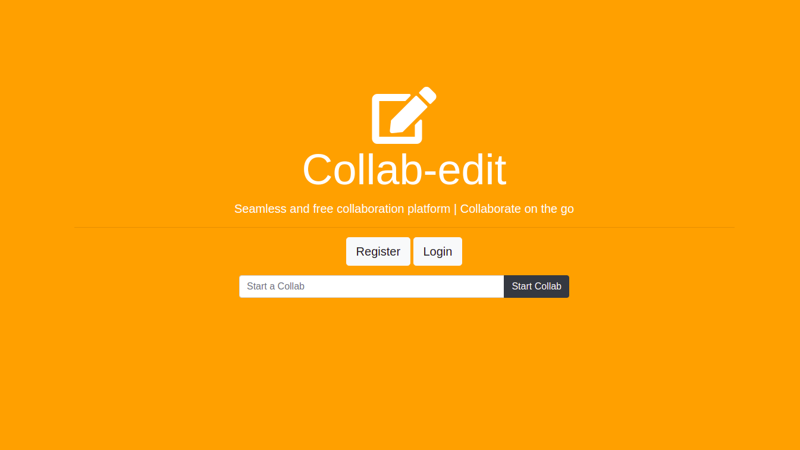

<h1>CollabEdit</h1>

<kbd></kbd>

Collaborative text editor built using CRDT data structure

## Setup Instructions  
1. Start a mongodb instance and update the database connection URL in `src/database/database.js`  
2. Run `npm install`   
3. Run `npm start`  
4. Visit localhost:3000 

## Features
- Quick collab: Any user can just hop on the website, enter a file name and start collaborating on the document by sharing the collaboration link with other users.
- Authorisation and authentication: Users can register for an account and create, edit and save any number of documents without being public.
- Collaboration: Authorised users can share the link and invite other (anonymous or authorised) users to edit the document.

## Future Works
- Pasting of text needs to be handled.
- The editor can be made to support advanced markup features.